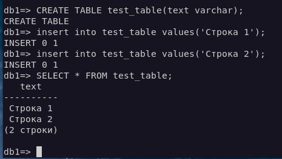
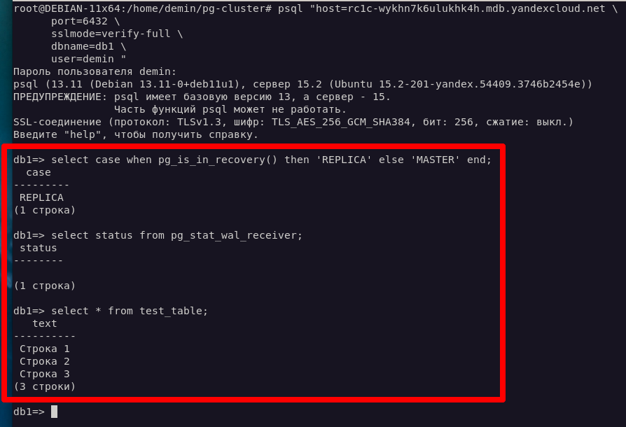

# Домашнее задание к занятию «Базы данных в облаке» Андрей Дёмин

### Задание 1


#### Создание кластера
1. Перейдите на главную страницу сервиса Managed Service for PostgreSQL.
1. Создайте кластер PostgreSQL со следующими параметрами:
- класс хоста: s2.micro, диск network-ssd любого размера;


- хосты: нужно создать два хоста в двух разных зонах доступности и указать необходимость публичного доступа, то есть публичного IP адреса, для них;


- установите учётную запись для пользователя и базы.

Остальные параметры оставьте по умолчанию либо измените по своему усмотрению.

* Нажмите кнопку «Создать кластер» и дождитесь окончания процесса создания, статус кластера = RUNNING. Кластер создаётся от 5 до 10 минут.


Подключение к мастеру и реплике 

* Используйте инструкцию по подключению к кластеру, доступную на вкладке «Обзор»: cкачайте SSL-сертификат и подключитесь к кластеру с помощью утилиты psql,
указав hostname всех узлов и атрибут
```target_session_attrs=read-write```


* Проверьте, что подключение прошло к master-узлу.
```sql
select case when pg_is_in_recovery() then 'REPLICA' else 'MASTER' end;
```
* Посмотрите количество подключенных реплик:
```sql
select count(*) from pg_stat_replication;
```


* Проверьте работоспособность репликации в кластере

* Создайте таблицу и вставьте одну-две строки.

```sql
CREATE TABLE test_table(text varchar);
```
```sql
insert into test_table values('Строка 1');
```


* Выйдите из psql командой ```\q```

* Теперь подключитесь к узлу-реплике. Для этого из команды подключения удалите атрибут ```target_session_attrs```  и в параметре атрибут ```host``` передайте
только имя хоста-реплики. Роли хостов можно посмотреть на соответствующей вкладке UI консоли.

* Проверьте, что подключение прошло к узлу-реплике.

```sql
select case when pg_is_in_recovery() then 'REPLICA' else 'MASTER' end;
```

* Проверьте состояние репликации

```sql
select status from pg_stat_wal_receiver;
```

* Для проверки, что механизм репликации данных работает между зонами доступности облака, выполните запрос к таблице, созданной на предыдущем шаге:

```sql
select * from test_table;
```

*В качестве результата вашей работы пришлите скриншоты:*

*1) Созданной базы данных;*
*2) Результата вывода команды на реплике ```select * from test_table;```*


---

### Задание 2*

Создайте кластер, как в задании 1 с помощью Terraform.

В качестве результата вашей работы пришлите скришоты:

1) Скриншот созданной базы данных.
2) Код Terraform, создающий базу данных.


```
terraform {
  required_providers {
    yandex = {
      source = "yandex-cloud/yandex"
    }
  }
}

provider "yandex" {
  token     = var.cloud_access_token
  cloud_id  = var.cloud_access_cloud_id
  folder_id = var.cloud_access_folder_id
  zone      = "ru-central1-c"
}

resource "yandex_mdb_postgresql_cluster" "mycluster" {
  name                = "mycluster"
  environment         = "PRESTABLE"
  network_id          = yandex_vpc_network.mynet.id
  security_group_ids  = [ yandex_vpc_security_group.pgsql-sg.id ]
  deletion_protection = false

  config {
    version = 15
    resources {
      resource_preset_id = "s2.micro"
      disk_type_id       = "network-ssd"
      disk_size          = "10"
    }
  }

  host {
    assign_public_ip = true
    zone      = "ru-central1-a"
    name      = "mypg-host-a"
    subnet_id = yandex_vpc_subnet.mysubnet-a.id
  }

  host {
    assign_public_ip = true
    zone      = "ru-central1-b"
    name      = "mypg-host-b"
    subnet_id = yandex_vpc_subnet.mysubnet-b.id
  }
  
  host {
    assign_public_ip = true
    zone      = "ru-central1-c"
    name      = "mypg-host-c"
    subnet_id = yandex_vpc_subnet.mysubnet-c.id
  }
}

resource "yandex_mdb_postgresql_database" "db1" {
  cluster_id = yandex_mdb_postgresql_cluster.mycluster.id
  name       = "db1"
  owner      = "demin"
  depends_on = [
    yandex_mdb_postgresql_user.demin
  ]
}

resource "yandex_mdb_postgresql_user" "demin" {
  cluster_id = yandex_mdb_postgresql_cluster.mycluster.id
  name       = "demin"
  password   = "password"
}    

resource "yandex_vpc_network" "mynet" {
  name = "mynet"
}

resource "yandex_vpc_subnet" "mysubnet-a" {
  name           = "mysubnet-a"
  zone           = "ru-central1-a"
  network_id     = yandex_vpc_network.mynet.id
  v4_cidr_blocks = ["10.5.0.0/24"]
}

resource "yandex_vpc_subnet" "mysubnet-b" {
  name           = "mysubnet-b"
  zone           = "ru-central1-b"
  network_id     = yandex_vpc_network.mynet.id
  v4_cidr_blocks = ["10.6.0.0/24"]
}

resource "yandex_vpc_subnet" "mysubnet-c" {
  name           = "mysubnet-c"
  zone           = "ru-central1-c"
  network_id     = yandex_vpc_network.mynet.id
  v4_cidr_blocks = ["10.7.0.0/24"]
}


resource "yandex_vpc_security_group" "pgsql-sg" {
  name       = "pgsql-sg"
  network_id = yandex_vpc_network.mynet.id

  ingress {
    description    = "PostgreSQL"
    port           = 6432
    protocol       = "TCP"
    v4_cidr_blocks = [ "0.0.0.0/0" ]
  }
}

```

---

---

---

---


